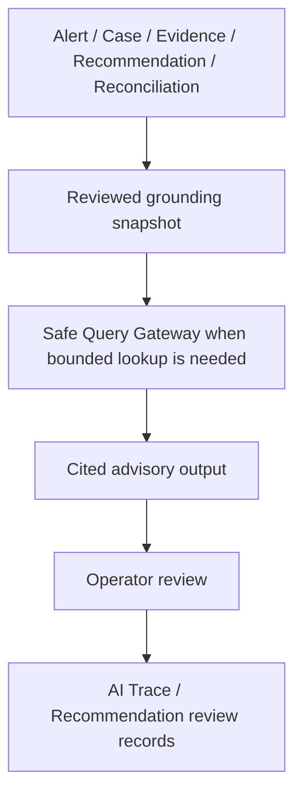

# AegisOps

**AegisOps** is a governed SecOps control plane above external detection and automation substrates.

It is **not** a SIEM/SOAR replacement.
It is the layer that owns the authoritative record chain for analyst work, approval, delegation, execution, and reconciliation.
AegisOps is built to support **human-controlled security operations** with an explicit authority boundary for approvals, evidence, action intent, and reconciliation.

Current scope:

- Platform baseline definition
- Architecture design and operating guidance
- Repository scaffolding
- Parameter catalog structure
- Implementation guardrails for AI-assisted development

The repository is no longer design-only: Phase 16 defines the approved first-boot runtime target for Phase 17 bring-up.
That first-boot target is limited to the AegisOps control-plane service, PostgreSQL for control-plane state, the approved reverse proxy boundary, and reviewed Wazuh-facing analytic-signal intake expectations.
OpenSearch, n8n, the full analyst-assistant surface, and the high-risk executor path remain optional, deferred, or non-blocking for first boot.

Initial standard substrates:

- **Wazuh** — reviewed detection substrate and upstream signal source
- **Shuffle** — reviewed routine automation substrate for approved low-risk actions

Current optional / transitional assets:

- **OpenSearch** — optional or transitional analytics substrate, not the product core
- **Sigma** — optional or transitional rule-definition format or translation source, not the product core
- **n8n** — optional, transitional, or experimental orchestration substrate, not the product core

---

## What AegisOps is

AegisOps takes upstream security signals and turns them into an operator-trustworthy record chain:

`Analytic Signal -> Alert -> Case -> Evidence -> Recommendation -> Action Request -> Approval -> Delegation -> Action Execution -> Reconciliation`

The core idea is simple:

- upstream tools may detect or execute,
- but **AegisOps owns the authoritative truth** for policy-sensitive workflow state.

That means:

- alerts and cases are AegisOps records
- evidence custody is explicit
- approvals are first-class records
- execution is separate from approval
- downstream workflow success does not automatically become control-plane truth
- reconciliation mismatch is preserved instead of silently normalized away

---

## What AegisOps is not

AegisOps is **not**:

- a self-built replacement for all SIEM features
- a self-built replacement for all SOAR features
- a broad autonomous response platform
- a broad source-coverage platform trying to rebuild Wazuh-class breadth
- an AI-first SOC that lets an assistant become approval or execution authority

---

## Current mainline architecture

### Mainline components

| Layer | Mainline component | Responsibility |
| --- | --- | --- |
| Detection substrate | Wazuh | Produces reviewed upstream substrate detection records |
| Control plane | AegisOps Control Plane Runtime | Owns analytic-signal admission, alert/case/evidence/recommendation/action/reconciliation truth |
| Automation substrate | Shuffle | Executes reviewed delegated low-risk automation only |
| Persistence | PostgreSQL | Authoritative AegisOps control-plane record store |
| Access boundary | Reverse Proxy | Approved ingress, auth boundary, readiness surface |

### Optional / transitional components

| Component | Current role |
| --- | --- |
| OpenSearch | Optional analytics / hunting / secondary assistant enrichment |
| Sigma | Optional research / prototyping asset |
| n8n | Optional / transitional / experimental orchestration asset |

---

## First-use flow

```mermaid
flowchart LR
    A[Wazuh or reviewed source family] --> B[Substrate Detection Record]
    B --> C[AegisOps Analytic Signal Admission]
    C --> D[Alert Queue]
    D --> E[Case and Evidence]
    E --> F[Cited Recommendation]
    F --> G[Action Request]
    G --> H[Human Approval]
    H --> I{Approved?}
    I -->|No / Expired / Rejected| J[Record outcome and keep review state explicit]
    I -->|Yes| K[Reviewed Delegation]
    K --> L[Shuffle or reviewed executor]
    L --> M[Action Execution]
    M --> N[Reconciliation]
    N --> O[Operator-visible audit trail]
```



### Assistant path

The assistant is downstream of reviewed records and remains advisory-only.
The assistant remains advisory-only.

The first bounded live assistant workflow family is limited to queue triage summary and case summary.



Important:

- the assistant does **not** approve actions
- the assistant does **not** execute actions
- the assistant does **not** become reconciliation truth
- the bounded live assistant workflow family remains queue triage summary and case summary only
- optional OpenSearch enrichment is secondary and must never outrank reviewed control-plane truth

---

## Current status

As of the current mainline phase, AegisOps is no longer just a design repo.

It already has:

- a bootable control-plane runtime
- reviewed Wazuh-backed live ingest
- thin operator surfaces for queue / alert / case / cited advisory review
- a first live low-risk action path: `notify_identity_owner`
- reviewed Shuffle delegation for that path
- authoritative `Action Execution` and `Reconciliation`
- production-like auth / secret-loading / readiness / restore / observability hardening
- a reviewed second identity-rich live source onboarding path

It is still **not**:

- a broad autonomous response platform
- a broad multi-action automation catalog
- a broad source-breadth SIEM
- a high-risk live action platform
- a 24x7 SOC product

---

## The first reviewed live action

The first reviewed live action is intentionally narrow:

- **Action:** `notify_identity_owner`
- **Class:** `Notify`
- **Execution path:** reviewed Shuffle delegation
- **Safety model:** approval-bound when required, exact binding preserved, authoritative `Action Execution` and `Reconciliation` retained by AegisOps

This is deliberate.

AegisOps grows by widening **reviewed, fail-closed paths** one at a time, not by opening a broad automation catalog early.

---

## Core principles

- **Detection, control, automation, and execution are explicitly separated**
- **AegisOps owns policy-sensitive workflow truth**
- **Approval and execution are separate first-class records**
- **Evidence and AI output are not the same thing**
- **Fail closed is the default**
- **Reverse-proxy-only ingress is the reviewed path**
- **Secrets are never committed to Git**
- **Restore, readiness, and observability are product requirements, not afterthoughts**
- **AI remains advisory-only**

---

## What an operator can do today

Within the current reviewed live slice, an operator can:

- inspect the analyst queue
- review alert details
- review case details
- inspect evidence provenance and reviewed context
- review cited advisory output
- review the bounded live assistant workflow family for queue triage summary and case summary
- create a reviewed action request from a cited recommendation
- send the first reviewed live low-risk action (`notify_identity_owner`) through the approved path
- inspect authoritative execution and reconciliation state
- use backup / restore / readiness / health surfaces within the reviewed runtime boundary

---

## What is intentionally still narrow

The following areas remain intentionally narrow or deferred:

- broader live action catalog beyond the first low-risk path
- high-risk executor wiring in production-like mainline
- broad source expansion beyond reviewed identity-rich families
- broad browser-first UI expansion
- AI authority of any kind over approval / execution / reconciliation
- OpenSearch as a required mainline dependency
- n8n as the mainline security orchestration path

---

## Repository layout

```text
aegisops/
├── docs/
├── control-plane/
├── postgres/
├── proxy/
├── ingest/
├── opensearch/   # optional / transitional
├── sigma/        # optional / transitional
├── n8n/          # optional / transitional
├── scripts/
├── config/
└── .env.sample
```

Notes:

- **Control Plane Runtime** — future authoritative AegisOps service boundary for platform state and reconciliation
Within `control-plane/`, the first live AegisOps-owned control-plane runtime will live as application code and service-local tests.
Within `postgres/`, the `control-plane/` directory is the repository home for the reviewed AegisOps-owned control-plane schema baseline and migration assets. It does not authorize live deployment, production data migration, or credentials.
That schema boundary remains separate from n8n-owned PostgreSQL metadata and execution-state tables, and future rollout, access-control, and index-tuning work stays explicit.
- OpenSearch, Sigma, and n8n remain repository-tracked assets, but they are subordinate to the approved control-plane thesis and must not redefine the product narrative around themselves.
- The current top-level tree still includes older substrate-specific directories and should be treated as transitional until a later ADR approves any substrate-specific repository rebaseline.

---

## Safety model at a glance

### Action classes

| Class | Meaning | Mainline posture |
| --- | --- | --- |
| `Read` | Non-mutating lookup or inspection | Allowed within reviewed boundaries |
| `Notify` | Communication without changing the protected target | First live mainline path exists |
| `Soft Write` | Reversible low-impact external coordination or workflow state change | Future narrow expansion only |
| `Hard Write` | Material target-state change | Not a broad live mainline capability |

### Approval model

- requester, approver, and executor identities remain distinct
- approval binds exact request scope and payload
- downstream observed execution must preserve reviewed binding identifiers
- reconciliation mismatches are preserved explicitly

---

## Source strategy

AegisOps prefers **identity-rich** source families before broad generic expansion.

Current reviewed direction:

- Wazuh as the first live detection substrate
- GitHub audit as an important reviewed live slice
- identity-rich second source onboarding already started
- next source growth remains narrow and reviewed

The goal is not to ingest everything.
The goal is to ingest source families that preserve accountable actor, target, privilege, and provenance context.

---

## AI / assistant strategy

The assistant is useful only when it stays inside the reviewed boundary.

It must:

- ground on reviewed control-plane records first
- preserve citations for every claim
- fail closed on identity ambiguity when stable identifiers differ
- treat prompt text as untrusted input
- fall back to control-plane-only grounding when optional enrichment is absent or conflicting

It must not:

- approve actions
- execute actions
- mutate authoritative records as final authority
- turn optional OpenSearch enrichment into authoritative truth

---

## Non-goals

The following are intentionally not current goals:

- full autonomous response
- unrestricted destructive automation
- high-risk action broadening
- commercial-SIEM-style source breadth
- multi-tenant platform design
- premature enterprise control-plane expansion
- AI-first SOC operation

---

## Who should use AegisOps

AegisOps is the reviewed control plane for approval, evidence, and reconciliation governance for a narrow SMB SecOps operating model.

The primary deployment target is a single-company or single-business-unit deployment with roughly 250 to 1,500 managed endpoints, 2 to 6 business-hours SecOps operators, and 1 to 3 designated approvers or escalation owners.

The target operating assumption is business-hours review with explicit after-hours escalation, not a 24x7 staffed SOC.

The reviewed footprint and deployment-profile baseline for that target lives in `docs/smb-footprint-and-deployment-profile-baseline.md`.

AegisOps is best suited for:

- small SecOps teams
- business-hours operator workflows
- environments that want reviewed, fail-closed automation growth
- teams that care more about evidence, approval, and reconciliation quality than about broad automation quantity

It is **not** trying to be the fastest way to enable every automation everywhere.
It is trying to be a safer way to operate a narrow but trustworthy SecOps control plane.

---

## Where to look next

Recommended starting points for a new reader:

- `docs/requirements-baseline.md`
- `docs/smb-footprint-and-deployment-profile-baseline.md`
- `docs/control-plane-state-model.md`
- `docs/automation-substrate-contract.md`
- `docs/response-action-safety-model.md`
- `docs/phase-15-identity-grounded-analyst-assistant-boundary.md`
- `docs/phase-24-first-live-assistant-workflow-family-and-trusted-output-contract.md`
- `docs/runbook.md`

If you want the shortest mental model, remember this:

> **Wazuh detects. AegisOps decides, records, and reconciles. Shuffle executes only the reviewed delegated work.**
