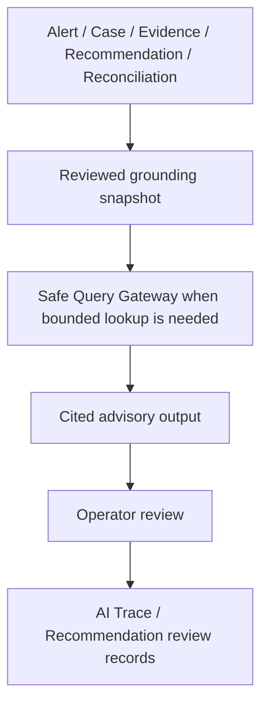

# AegisOps

**AegisOps** is a governed SecOps control plane above external detection and automation substrates.

It is **not** a broad standalone replacement for every SIEM/SOAR capability.
It is the layer that owns the authoritative record chain for analyst work, approval, delegation, execution, and reconciliation.
AegisOps is built to support **human-controlled security operations** with an explicit authority boundary for approvals, evidence, action intent, and reconciliation.

Current scope:

- Platform baseline definition
- Architecture design and operating guidance
- Repository scaffolding
- Parameter catalog structure
- Implementation guardrails for AI-assisted development

Canonical cross-phase boundary reference:

- `docs/non-goals-and-expansion-guardrails.md`
- `docs/adr/0011-phase-51-1-replacement-boundary.md` defines the Phase 51.1 SMB SecOps replacement boundary: AegisOps replaces the operating experience above Wazuh and Shuffle, not their internals or every SIEM/SOAR capability.
- [Phase 51.3 pilot beta RC GA gate contract](docs/phase-51-3-pilot-beta-rc-ga-gate-contract.md) defines the Pilot, Beta, RC, and GA evidence gates for replacement-readiness materialization.
- [Phase 51.4 SMB personas and jobs-to-be-done matrix](docs/phase-51-4-smb-personas-jobs-to-be-done.md) defines the internal IT manager, part-time security operator, approver/escalation owner, platform admin, and bounded external support collaborator personas for later replacement-roadmap work.
- [Phase 51.5 competitive gap matrix](docs/phase-51-5-competitive-gap-matrix.md) compares the replacement operating-experience target against standalone Wazuh, standalone Shuffle, manual SOC/ticket workflow, and common SMB SIEM/SOAR expectations.
- [Phase 51.6 authority-boundary negative-test policy](docs/phase-51-6-authority-boundary-negative-test-policy.md) defines the fail-closed negative-test classes later AI, Wazuh, Shuffle, ticket, evidence, browser, UI cache, downstream receipt, and demo-data work must cite.
- [Phase 52.1 CLI command contract](docs/phase-52-1-cli-command-contract.md) defines the first-user stack command contract for `init`, `up`, `doctor`, `seed-demo`, `status`, `open`, `logs`, and `down`.
- [Phase 52.2 SMB single-node profile model](docs/phase-52-2-smb-single-node-profile-model.md) defines the `smb-single-node` setup profile sections, mode labels, generated-config expectations, validation rules, and authority boundary.
- [Phase 52.3 combined dependency matrix](docs/deployment/combined-dependency-matrix.md) defines first-user stack dependency expectations, host footprint, ports, volumes, certificate requirements, incompatibilities, and host-preflight follow-up fields.
- [Phase 52.4 compose generator contract](docs/deployment/compose-generator-contract.md) defines generated Compose shape, proxy-only ingress, snapshot expectations, and manual-editing rejection for the executable first-user stack.
- [Phase 52.5 env secrets certs contract](docs/deployment/env-secrets-certs-contract.md) defines generated runtime env config, ignored secret/cert paths, demo token/cert posture, and fail-closed secret validation for the executable first-user stack.
- [Phase 52.6 host preflight contract](docs/deployment/host-preflight-contract.md) defines Docker, Compose, RAM, disk, port, `vm.max_map_count`, and profile-validity readiness checks and fixture expectations for the executable first-user stack.
- [Phase 52.7 demo seed contract](docs/deployment/demo-seed-contract.md) defines demo-only seed records, required labels, reset boundaries, and production-exclusion fixtures for the executable first-user stack.
- [Phase 52.8 clean-host smoke skeleton](docs/deployment/clean-host-smoke-skeleton.md) defines the mocked/skipped `init -> up -> doctor -> seed-demo` fixture path and false-success rejection rules for the executable first-user stack.
- [Phase 52.9 first-user stack overview](docs/deployment/first-user-stack.md) defines the few-command first-user path, troubleshooting links, pre-GA status, and authority boundary for the executable first-user stack.
- [Phase 52.10 closeout evaluation](docs/phase-52-closeout-evaluation.md) records the Phase 52 child issue outcomes, focused verifier results, issue-lint summary, accepted limitations, and Phase 53/54 materialization recommendation.
- [Phase 52.5 closeout evaluation](docs/phase-52-5-closeout-evaluation.md) records the Phase 52.5 package-layout hardening outcomes, moved modules, compatibility shims, verifier results, accepted limitations, and bounded Phase 53 readiness recommendation.
- [Phase 52.6 closeout evaluation](docs/phase-52-6-closeout-evaluation.md) records the Phase 52.6 compatibility-shim deprecation outcomes, root package count reduction, retained owners and blockers, verifier results, and bounded Phase 53 readiness recommendation.
- [Phase 52.7 closeout evaluation](docs/phase-52-7-closeout-evaluation.md) records the Phase 52.7 namespace normalization outcomes, root owner reduction, compatibility behavior, namespace/path guardrails, verifier results, and bounded Phase 53 readiness recommendation.

## Product positioning

Current status: AegisOps has a strong pilot foundation, but it is still pre-GA and is not yet a self-service commercial replacement.

Target status: AegisOps aims to provide an AI-agent-native SMB SOC/SIEM/SOAR operating experience above Wazuh and Shuffle.

Replacement means the operating experience and authoritative record chain for daily SMB security operations, not Wazuh internals, Shuffle internals, or every SIEM/SOAR capability.

The Phase 51 replacement boundary is defined by `docs/adr/0011-phase-51-1-replacement-boundary.md`.

The Phase 51.3 Pilot, Beta, RC, and GA gate contract is defined by the [Phase 51.3 pilot beta RC GA gate contract](docs/phase-51-3-pilot-beta-rc-ga-gate-contract.md); Phase 66 is RC and Phase 67 is GA.

The Phase 51.4 SMB personas and jobs-to-be-done matrix is defined by the [Phase 51.4 SMB personas and jobs-to-be-done matrix](docs/phase-51-4-smb-personas-jobs-to-be-done.md).

The Phase 51.5 competitive gap matrix is defined by the [Phase 51.5 competitive gap matrix](docs/phase-51-5-competitive-gap-matrix.md).

The Phase 51.6 authority-boundary negative-test policy is defined by the [Phase 51.6 authority-boundary negative-test policy](docs/phase-51-6-authority-boundary-negative-test-policy.md).

The Phase 52.1 first-user CLI command contract is defined by the [Phase 52.1 CLI command contract](docs/phase-52-1-cli-command-contract.md).

The Phase 52.2 first-user SMB single-node profile model is defined by the [Phase 52.2 SMB single-node profile model](docs/phase-52-2-smb-single-node-profile-model.md).

The Phase 52.3 first-user combined dependency matrix is defined by the [Phase 52.3 combined dependency matrix](docs/deployment/combined-dependency-matrix.md).

The Phase 52.4 first-user compose generator contract is defined by the [Phase 52.4 compose generator contract](docs/deployment/compose-generator-contract.md).

The Phase 52.5 first-user env secrets certs contract is defined by the [Phase 52.5 env secrets certs contract](docs/deployment/env-secrets-certs-contract.md).

The Phase 52.6 first-user host preflight contract is defined by the [Phase 52.6 host preflight contract](docs/deployment/host-preflight-contract.md).

The Phase 52.7 first-user demo seed contract is defined by the [Phase 52.7 demo seed contract](docs/deployment/demo-seed-contract.md).

The Phase 52.8 first-user clean-host smoke skeleton is defined by the [Phase 52.8 clean-host smoke skeleton](docs/deployment/clean-host-smoke-skeleton.md).

The Phase 52.9 first-user stack overview is defined by the [Phase 52.9 first-user stack overview](docs/deployment/first-user-stack.md).

The Phase 52.10 closeout evaluation is defined by the [Phase 52.10 closeout evaluation](docs/phase-52-closeout-evaluation.md).

The Phase 52.5 package-layout hardening closeout is defined by the [Phase 52.5 closeout evaluation](docs/phase-52-5-closeout-evaluation.md).

The Phase 52.6 compatibility-shim deprecation closeout is defined by the [Phase 52.6 closeout evaluation](docs/phase-52-6-closeout-evaluation.md).

The Phase 52.7 namespace normalization closeout is defined by the [Phase 52.7 closeout evaluation](docs/phase-52-7-closeout-evaluation.md).

Wazuh detects, AegisOps decides, records, and reconciles, and Shuffle executes reviewed delegated routine work.

AegisOps control-plane records remain authoritative for alert, case, evidence, approval, action request, execution receipt, reconciliation, audit, and release truth.

AI remains advisory-only and non-authoritative; it must not approve, execute, reconcile, close cases, activate detectors, or become source truth.

Forbidden overclaim: AegisOps must not be described as already GA, already self-service commercial, a replacement for every SIEM/SOAR capability, a reimplementation of Wazuh or Shuffle internals, or a broad autonomous SOC.

Phase 44-47 closure contracts:

- Phase 44-47 boundary docs:
  - `docs/phase-44-pilot-ingress-and-operator-surface-closure-boundary.md`
  - `docs/phase-45-daily-soc-queue-and-operator-ux-hardening-boundary.md`
  - `docs/phase-46-approval-execution-reconciliation-operations-pack-boundary.md`
  - `docs/phase-47-control-plane-responsibility-decomposition-boundary.md`
- Phase 44-47 validation docs:
  - `docs/phase-44-pilot-ingress-and-operator-surface-closure-validation.md`
  - `docs/phase-45-daily-soc-queue-and-operator-ux-hardening-validation.md`
  - `docs/phase-46-approval-execution-reconciliation-operations-pack-validation.md`
  - `docs/phase-47-control-plane-responsibility-decomposition-validation.md`

AegisOps control-plane records remain authoritative. The operator UI, proxy, Zammad, assistant, optional evidence, downstream receipts, and maintainability projections remain subordinate context.

Current automation gate:

- Before Phase 49.0, Phase 49, or Phase 52+ work is created, scheduled, or executed, run the roadmap materialization preflight from `docs/roadmap-materialization-preflight-contract.md`.
- The required repo-owned Phase 49 command is `bash scripts/roadmap-materialization-preflight.sh --graph docs/automation/roadmap-materialization-phase-graph.json --target-phase 49.0 --issue-source github`.
- The required repo-owned post-Phase50 command is `bash scripts/roadmap-materialization-preflight.sh --graph docs/automation/roadmap-materialization-phase-graph.json --target-phase 52 --issue-source github`.
- The focused fixture path is `bash scripts/test-verify-roadmap-materialization-preflight.sh`.

The repository is no longer design-only: Phase 16 defines the approved first-boot runtime target for Phase 17 bring-up.
That first-boot target is limited to the AegisOps control-plane service, PostgreSQL for control-plane state, the approved reverse proxy boundary, and reviewed Wazuh-facing analytic-signal intake expectations.
OpenSearch, n8n, the full analyst-assistant surface, and the high-risk executor path remain optional, deferred, or non-blocking for first boot.

Initial standard substrates:

- **Wazuh** — reviewed detection substrate and upstream signal source
- **Shuffle** — reviewed routine automation substrate for approved low-risk actions

Current optional / transitional assets:

- **OpenSearch** — optional or transitional analytics substrate, not the product core
- **Sigma** — optional or transitional rule-definition format or translation source, not the product core
- **n8n** — optional, transitional, or experimental orchestration substrate, not the product core

---

## What AegisOps is

AegisOps takes upstream security signals and turns them into an operator-trustworthy record chain:

`Analytic Signal -> Alert -> Case -> Evidence -> Recommendation -> Action Request -> Approval -> Delegation -> Action Execution -> Reconciliation`

The core idea is simple:

- upstream tools may detect or execute,
- but **AegisOps owns the authoritative truth** for policy-sensitive workflow state.

That means:

- alerts and cases are AegisOps records
- evidence custody is explicit
- approvals are first-class records
- execution is separate from approval
- downstream workflow success does not automatically become control-plane truth
- reconciliation mismatch is preserved instead of silently normalized away

---

## What AegisOps is not

AegisOps is **not**:

- a self-built replacement for all SIEM features
- a self-built replacement for all SOAR features
- a broad autonomous response platform
- a broad source-coverage platform trying to rebuild Wazuh-class breadth
- an AI-first SOC that lets an assistant become approval or execution authority

For the cross-phase registry of expansion boundaries that future work should cite directly, see `docs/non-goals-and-expansion-guardrails.md`.

---

## Current mainline architecture

### Mainline components

| Layer | Mainline component | Responsibility |
| --- | --- | --- |
| Detection substrate | Wazuh | Produces reviewed upstream substrate detection records |
| Control plane | AegisOps Control Plane Runtime | Owns analytic-signal admission, alert/case/evidence/recommendation/action/reconciliation truth |
| Automation substrate | Shuffle | Executes reviewed delegated low-risk automation only |
| Persistence | PostgreSQL | Authoritative AegisOps control-plane record store |
| Access boundary | Reverse Proxy | Approved ingress, auth boundary, readiness surface |

### Optional / transitional components

| Component | Current role |
| --- | --- |
| OpenSearch | Optional analytics / hunting / secondary assistant enrichment |
| Sigma | Optional research / prototyping asset |
| n8n | Optional / transitional / experimental orchestration asset |

### Optional extension operability model

Operators must treat optional extension state as a repo-owned runtime interpretation, not as an inference from whether a package, sidecar, or external substrate happens to exist.

The reviewed readiness and inspection surfaces classify optional extensions with explicit enablement, availability, and readiness signals so the mainline guarantee remains clear:

| Extension family | Mainline guarantee | Default posture | Operator-visible interpretation |
| --- | --- | --- | --- |
| Assistant | The bounded live summary family may run on reviewed control-plane records, but it remains advisory-only and non-authoritative. | Enabled optional surface with non-blocking secondary enrichment. | `enabled` and `ready` means the bounded reviewed summary provider is available. Missing optional enrichment such as OpenSearch does not block the mainline reviewed workflow. |
| Endpoint evidence | Subordinate endpoint evidence packs may be collected only from an already reviewed case and approved bounded request. | Disabled by default. | `disabled_by_default` means no reviewed endpoint evidence request is active. `enabled` means a reviewed endpoint evidence request is active. `degraded` means the approved endpoint-evidence review path is lagging or missing receipts and must stay visible without becoming authority. |
| Optional network evidence | Optional network evidence packs remain subordinate to the reviewed control-plane chain. | Disabled by default. | `disabled_by_default` or `unavailable` means the optional network path is not activated on the mainline runtime and does not block boot, queue review, approval, execution, or reconciliation truth. |
| ML shadow | ML output remains shadow-only, audit-focused, and outside approval, execution, and reconciliation authority. | Disabled by default. | `disabled_by_default` or `unavailable` means the reviewed runtime is operating without ML shadow mode. Any future `enabled` or `degraded` state must remain explicitly shadow-only and non-blocking. |

If optional extension state is absent, unavailable, or degraded, operators must repair the extension surface or leave it disabled. They must not widen authority, infer healthy state from silence, or treat optional paths as first-boot prerequisites.

---

## First-use flow

```mermaid
flowchart LR
    A[Wazuh or reviewed source family] --> B[Substrate Detection Record]
    B --> C[AegisOps Analytic Signal Admission]
    C --> D[Alert Queue]
    D --> E[Case and Evidence]
    E --> F[Cited Recommendation]
    F --> G[Action Request]
    G --> H[Human Approval]
    H --> I{Approved?}
    I -->|No / Expired / Rejected| J[Record outcome and keep review state explicit]
    I -->|Yes| K[Reviewed Delegation]
    K --> L[Shuffle or reviewed executor]
    L --> M[Action Execution]
    M --> N[Reconciliation]
    N --> O[Operator-visible audit trail]
```



### Assistant path

The assistant is downstream of reviewed records and remains advisory-only.
The assistant remains advisory-only.

The first bounded live assistant workflow family is limited to queue triage summary and case summary.



Important:

- the assistant does **not** approve actions
- the assistant does **not** execute actions
- the assistant does **not** become reconciliation truth
- the bounded live assistant workflow family remains queue triage summary and case summary only
- optional OpenSearch enrichment is secondary and must never outrank reviewed control-plane truth

---

## Current status

As of the current mainline phase, AegisOps is no longer just a design repo.

It already has:

- a bootable control-plane runtime
- reviewed Wazuh-backed live ingest
- thin operator surfaces for queue / alert / case / cited advisory review
- a first live low-risk action path: `notify_identity_owner`
- reviewed Shuffle delegation for that path
- authoritative `Action Execution` and `Reconciliation`
- production-like auth / secret-loading / readiness / restore / observability hardening
- a reviewed second identity-rich live source onboarding path

It is still **not**:

- a broad autonomous response platform
- a broad multi-action automation catalog
- a broad source-breadth SIEM
- a high-risk live action platform
- a 24x7 SOC product

---

## The first reviewed live action

The first reviewed live action is intentionally narrow:

- **Action:** `notify_identity_owner`
- **Class:** `Notify`
- **Execution path:** reviewed Shuffle delegation
- **Safety model:** approval-bound when required, exact binding preserved, authoritative `Action Execution` and `Reconciliation` retained by AegisOps

This is deliberate.

AegisOps grows by widening **reviewed, fail-closed paths** one at a time, not by opening a broad automation catalog early.

---

## Core principles

- **Detection, control, automation, and execution are explicitly separated**
- **AegisOps owns policy-sensitive workflow truth**
- **Approval and execution are separate first-class records**
- **Evidence and AI output are not the same thing**
- **Fail closed is the default**
- **Reverse-proxy-only ingress is the reviewed path**
- **Secrets are never committed to Git**
- **Restore, readiness, and observability are product requirements, not afterthoughts**
- **AI remains advisory-only**

---

## What an operator can do today

Within the current reviewed live slice, an operator can:

- inspect the analyst queue
- review alert details
- review case details
- inspect evidence provenance and reviewed context
- review cited advisory output
- review the bounded live assistant workflow family for queue triage summary and case summary
- create a reviewed action request from a cited recommendation
- send the first reviewed live low-risk action (`notify_identity_owner`) through the approved path
- inspect authoritative execution and reconciliation state
- use backup / restore / readiness / health surfaces within the reviewed runtime boundary

---

## What is intentionally still narrow

The following areas remain intentionally narrow or deferred:

- broader live action catalog beyond the first low-risk path
- high-risk executor wiring in production-like mainline
- broad source expansion beyond reviewed identity-rich families
- broad browser-first UI expansion
- AI authority of any kind over approval / execution / reconciliation
- OpenSearch as a required mainline dependency
- n8n as the mainline security orchestration path

---

## Repository layout

```text
aegisops/
├── docs/
├── control-plane/
├── postgres/
├── proxy/
├── ingest/
├── opensearch/   # optional / transitional
├── sigma/        # optional / transitional
├── n8n/          # optional / transitional
├── scripts/
├── config/
└── .env.sample
```

Notes:

- **Control Plane Runtime** — future authoritative AegisOps service boundary for platform state and reconciliation
Within `control-plane/`, the first live AegisOps-owned control-plane runtime will live as application code and service-local tests.
Within `postgres/`, the `control-plane/` directory is the repository home for the reviewed AegisOps-owned control-plane schema baseline and migration assets. It does not authorize live deployment, production data migration, or credentials.
That schema boundary remains separate from n8n-owned PostgreSQL metadata and execution-state tables, and future rollout, access-control, and index-tuning work stays explicit.
- OpenSearch, Sigma, and n8n remain repository-tracked assets, but they are subordinate to the approved control-plane thesis and must not redefine the product narrative around themselves.
- The current top-level tree still includes older substrate-specific directories and should be treated as transitional until a later ADR approves any substrate-specific repository rebaseline.

---

## Safety model at a glance

### Action classes

| Class | Meaning | Mainline posture |
| --- | --- | --- |
| `Read` | Non-mutating lookup or inspection | Allowed within reviewed boundaries |
| `Notify` | Communication without changing the protected target | First live mainline path exists |
| `Soft Write` | Reversible low-impact external coordination or workflow state change | Future narrow expansion only |
| `Hard Write` | Material target-state change | Not a broad live mainline capability |

### Approval model

- requester, approver, and executor identities remain distinct
- approval binds exact request scope and payload
- downstream observed execution must preserve reviewed binding identifiers
- reconciliation mismatches are preserved explicitly

---

## Source strategy

AegisOps prefers **identity-rich** source families before broad generic expansion.

Current reviewed direction:

- Wazuh as the first live detection substrate
- GitHub audit as an important reviewed live slice
- identity-rich second source onboarding already started
- next source growth remains narrow and reviewed

The goal is not to ingest everything.
The goal is to ingest source families that preserve accountable actor, target, privilege, and provenance context.

---

## AI / assistant strategy

The assistant is useful only when it stays inside the reviewed boundary.

It must:

- ground on reviewed control-plane records first
- preserve citations for every claim
- fail closed on identity ambiguity when stable identifiers differ
- treat prompt text as untrusted input
- fall back to control-plane-only grounding when optional enrichment is absent or conflicting

It must not:

- approve actions
- execute actions
- mutate authoritative records as final authority
- turn optional OpenSearch enrichment into authoritative truth

---

## Non-goals

The following are intentionally not current goals:

- full autonomous response
- unrestricted destructive automation
- high-risk action broadening
- commercial-SIEM-style source breadth
- multi-tenant platform design
- premature enterprise control-plane expansion
- AI-first SOC operation

---

## Who should use AegisOps

AegisOps is the reviewed control plane for approval, evidence, and reconciliation governance for a narrow SMB SecOps operating model.

The primary deployment target is a single-company or single-business-unit deployment with roughly 250 to 1,500 managed endpoints, 2 to 6 business-hours SecOps operators, and 1 to 3 designated approvers or escalation owners.

The target operating assumption is business-hours review with explicit after-hours escalation, not a 24x7 staffed SOC.

The reviewed footprint and deployment-profile baseline for that target lives in `docs/smb-footprint-and-deployment-profile-baseline.md`.

AegisOps is best suited for:

- small SecOps teams
- business-hours operator workflows
- environments that want reviewed, fail-closed automation growth
- teams that care more about evidence, approval, and reconciliation quality than about broad automation quantity

It is **not** trying to be the fastest way to enable every automation everywhere.
It is trying to be a safer way to operate a narrow but trustworthy SecOps control plane.

---

## Where to look next

Recommended starting points for a new reader:

- `docs/requirements-baseline.md`
- `docs/smb-footprint-and-deployment-profile-baseline.md`
- `docs/control-plane-state-model.md`
- `docs/automation-substrate-contract.md`
- `docs/response-action-safety-model.md`
- `docs/phase-15-identity-grounded-analyst-assistant-boundary.md`
- `docs/phase-24-first-live-assistant-workflow-family-and-trusted-output-contract.md`
- `docs/runbook.md`

If you want the shortest mental model, remember this:

> **Wazuh detects. AegisOps decides, records, and reconciles. Shuffle executes only the reviewed delegated work.**
